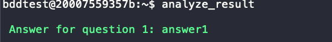
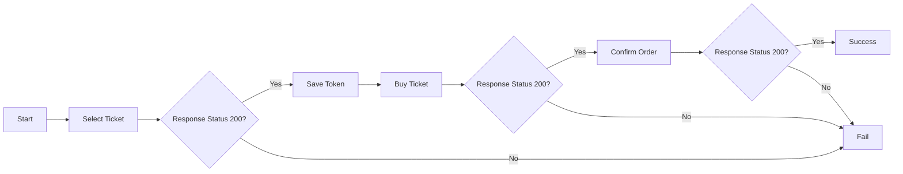

# Agenda

- 20mins briefing / Video Demo / Github
- Environment setup 15min
- 45mins Working on Q1-Q4
- 15mins debrief (Optional)


# Prerequisites

- Access the AWS workshop account
- create the cloud 9 instance
- Download the material from git hub
- Download the behave Docker image from the provided ECR URL. `docker pull ${Behave_ECR}`
- jump into Docker env to start on `docker run --rm -it -v ./testcases:/home/bddtest/testcases ${Behave_ECR} bash`

# Question 1

Build your BDD environment and execute the first test case. This command runs a Docker container with the behave-tool image, mounts the `./testcases` directory from the host to `/home/bddtest/testcases` inside the container, sets the `APP1_URL` environment variable to the provided URL, and executes the `behave` command with the [q1-header.feature](./features/q1-header.feature) file.

1. Jump into the Docker environment
2. `export APP1_URL=${APP1_URL}`
3. `behave testcases/features/q1-header.feature`
4. `analyst_result` you should get the answer like below 
5. visit CTF portal to submit your answer

# Question 2a

Under this challenge, you will be testing a mass assignment vulnerability's REST API endpoint of a web application. Using the Behave framework, you are to construct a Behavior-Driven Development (BDD) test script to test the /rest/v1/user, which is vulnerable to mass assignmentuser endpoint, trying to create a new user. Revised the case [q2-mass-assignment](./features/q2-mass-assignment.feature) fill int the blank **(FITB)** and receive the pass result.

1. Jump into the Docker environment
2. `export APP2_URL=${APP2_URL}`
3. Update the test case to get the pass result
4. `behave testcases/features/q2-mass-assignment.feature`
5. `analyst_result` you should get the answer
6. visit CTF portal to submit your answer

# Question 2b

/rest/v2/user is an updated version that includes the create user function to address the mass assignment issue. If you use the **Question 2a** test case to test the /rest/v2/user, you will receive a fail message; adjust the test case to test the endpoint already resolving the mass assignment issue. 

1. Jump into the Docker environment
2. `export APP2_URL=${APP2_URL}`
3. Update the test case endpoint to `/rest/v2/user` and trying to update the result to match the fix
4. `behave testcases/features/q2-mass-assignment.feature`
5. `analyst_result` you should get the answer
6. visit CTF portal to submit your answer

Attached below is the User object structure
```java
public class User {
    public static final String DEFAULT_EMAIL_DOMAIN = "@abc.net";
    public static final String DEFAULT_GROUP = "guest";

    @Getter
    private final long sid;
    @Getter
    private final String username;
    @Getter @Setter
    private String email;
    @Getter
    private String group;

    public void putGroup(String group) {
        this.group = group;
    }
}
```

# Question 3

Compose a BDD test case to retrieve the answer in the confirm order phase, referencing the [API doc](./API-DOC.md) and the flowchart provided. The template is [q3-workflow.feature](./features/q3-workflow.feature), and the testcase is being constructed by filling in the blank (FITB) with the statement supplied in order to obtain the answer to question 3.

Execution
1. Jump into the Docker environment
2. `export APP1_URL=${APP1_URL}`
3. Update the test case 
4. `behave testcases/features/q3-workflow.feature`
5. `analyst_result` you should get the answer
6. visit CTF portal to submit your answer

## Workflow

Attached below statment can help you to understand the workflow.



## Statements

```bash
I make a <ACTION> request to "<PATH>"
```
This statement is used to send an HTTP request with the specified <ACTION> (e.g., GET, POST, PUT, DELETE) to the provided <PATH> URL.


```bash
I set variable "<KEY>" to "<VALUE>"
```
This statement is used to set a variable with the specified <KEY> to the provided <VALUE>.

```bash
I set key to "<KEY>" and value to last stored value
```
This statement is used to set a variable with the specified <KEY> to the last stored value, which could be the response from a previous request or a variable set earlier.

```bash
A request payload template 
"""
<JSON>
"""
```
This statement allows you to provide a JSON payload template for an HTTP request. The <JSON> placeholder should be replaced with the actual JSON payload.

```bash
`{"<KEY>": "{{ <VALUE> }}", "<KEY>": "{{ <VALUE> }}"}`
```
This statement is used to construct a JSON payload with placeholders for variable substitution. The <KEY> placeholders should be replaced with the desired key names, and the {{ <VALUE> }} placeholders should be replaced with variables or values to be substituted

```bash
The response status should be <CODE>
```
This statement is used to assert that the response status code from the previous HTTP request matches the specified <CODE> value.